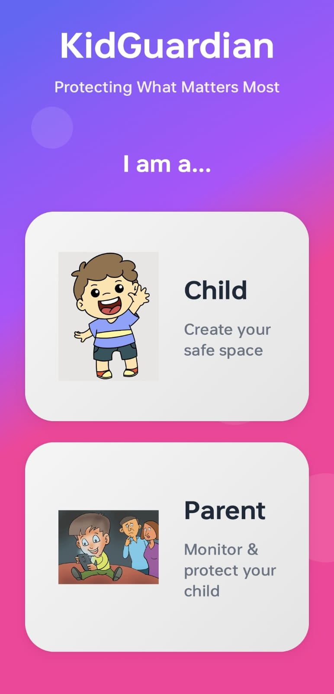
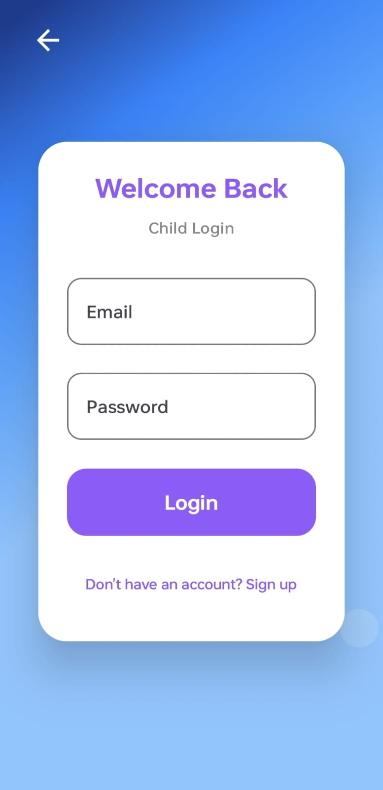
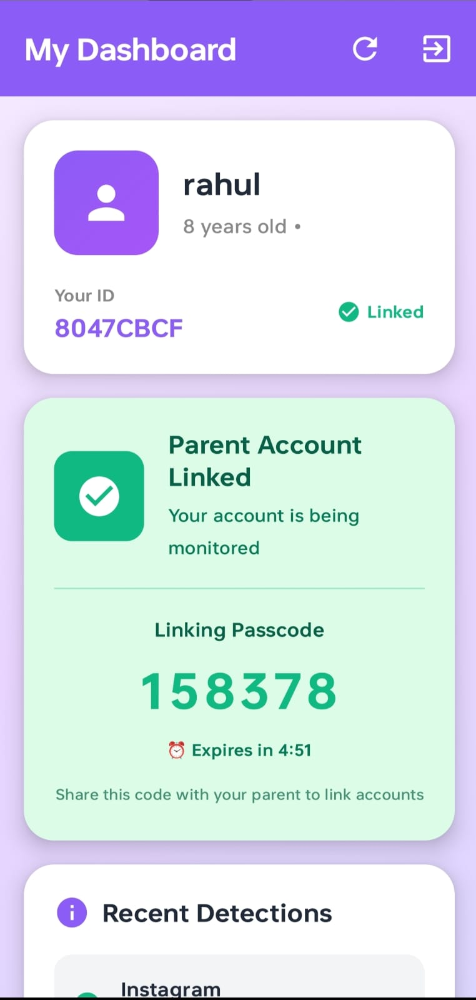
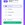
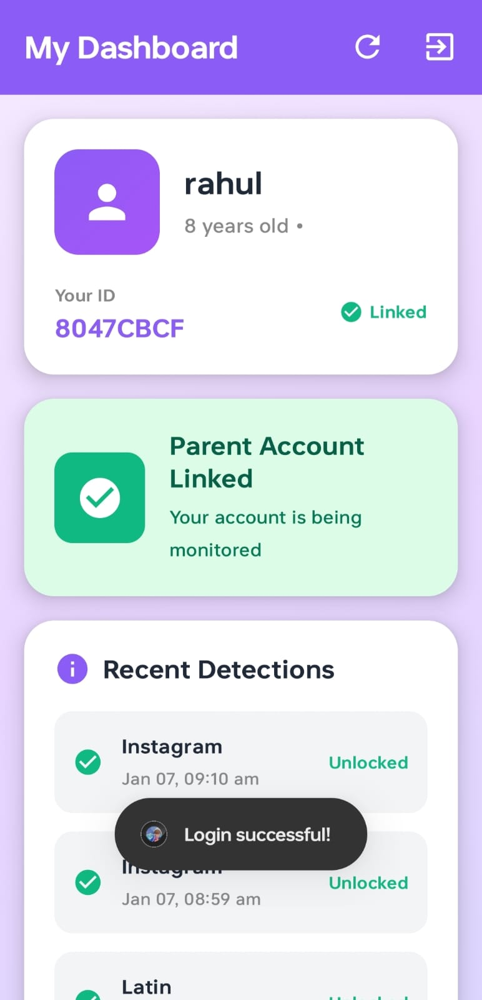
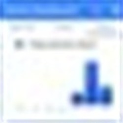
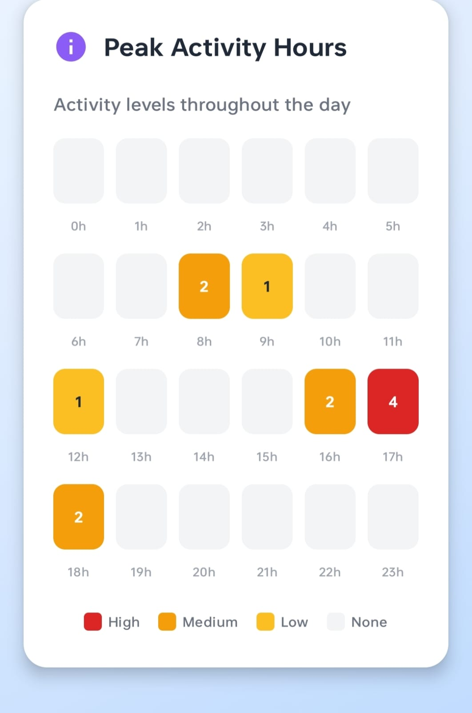

KidGuardian - Parental Control App

Screenshots

---

Overview

KidGuardian is an Android parental control application that monitors a child's device for inappropriate content and blocks the screen when detected. Parents receive unlock codes and can view detailed analytics about detected content.

---

User Flow

Child Setup
1. Child creates account with name, age, gender, and email
2. Child grants required permissions (Device Admin, Overlay, Accessibility)
3. Child generates a 6-digit linking passcode
4. Child shares passcode with parent

Parent Setup
1. Parent enters child's linking passcode
2. Parent creates profile (name, relationship)
3. Parent account is linked to child

Detection Flow
1. Child uses device normally
2. Accessibility service monitors screen content in real-time
3. When inappropriate word is detected, screen locks immediately
4. Parent receives notification with unlock code
5. Child must enter correct code to unlock device

Unlock Flow
1. Child sees lock screen with detected word
2. Child asks parent for unlock code
3. Parent provides 6-digit code from notification or dashboard
4. Child enters code and device unlocks

---

Technical Architecture

MVVM Structure
- Models: Child, Parent, Complaint, UserRole
- ViewModels: ParentDashboardViewModel, ChildDashboardViewModel, LockScreenViewModel
- Repository: UserRepository handles all Firebase operations
- UI: Jetpack Compose screens and components

Core Services

AbuseDetectionService (AccessibilityService)
- Monitors all screen text content
- Matches against abusive words database
- Tracks foreground app for accurate reporting
- Creates complaint and triggers lock screen

LockMonitorService (Foreground Service)
- Keeps lock screen active
- Prevents dismissal attempts
- Runs in kiosk mode when device owner

ScreenshotCaptureService
- Captures screenshot when abuse detected
- Uploads to Firebase Storage
- Attaches URL to complaint

Database Structure (Firebase Firestore)

children collection:
- childId, userId, name, age, gender, email
- parentLinked, linkedParents, linkPasscode
- logoutPasscode, passcodeGeneratedAt

parents collection:
- parentId, name, relationship, linkedChildId
- monitoringEnabled

complaints collection:
- complaintId, childId, detectedWord, appName
- screenshotUrl, category, secretCode
- timestamp, accessed, unlockTimestamp

Key Components

Permissions Required:
- Device Admin (for kiosk mode)
- System Alert Window (overlay)
- Accessibility Service (content monitoring)
- Media Projection (screenshots)

Detection Categories:
- Offensive Language
- Violence and Threats
- Sexual Content
- Substance Abuse
- Bullying and Harassment

---

File Structure

app/src/main/java/com/example/phonelock/
- Activities: Main, Auth, LockScreen, ChildDashboard, ParentDashboard, PermissionSetup
- Services: AbuseDetectionService, LockMonitorService, ScreenshotCaptureService
- Repository: UserRepository
- Models: UserModels, AbusiveWordsDatabase
- ViewModels: ParentDashboardViewModel, ChildDashboardViewModel
- UI Components: ui/parent/, ui/child/

---

Build Requirements

- Android Studio
- Min SDK: 24
- Target SDK: 34
- Kotlin
- Jetpack Compose
- Firebase (Auth, Firestore, Storage)

---

Setup

1. Clone repository
2. Add google-services.json to app folder
3. Enable Device Owner for kiosk mode:
   adb shell dpm set-device-owner com.example.phonelock/.MyDeviceAdminReceiver
4. Build and run

---

Notes

- Kiosk mode requires device owner permission
- Accessibility service must be manually enabled in settings
- Screenshot permission is requested on first detection
- Parent link status is checked every 5 seconds for responsiveness
